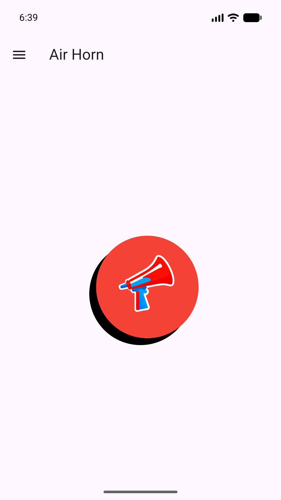
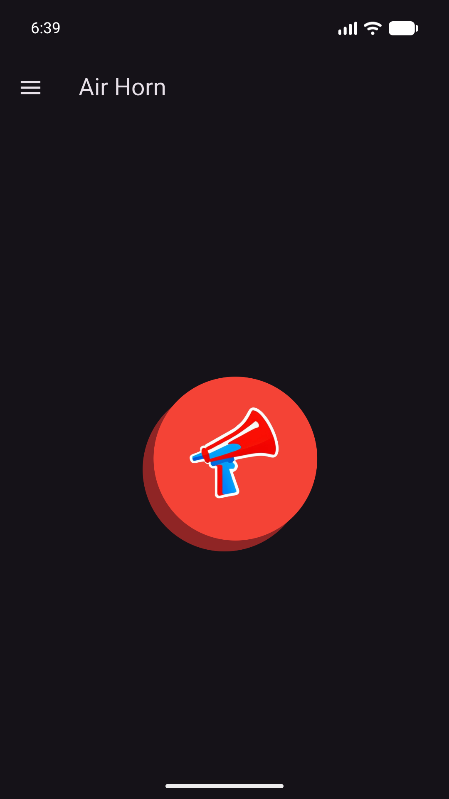
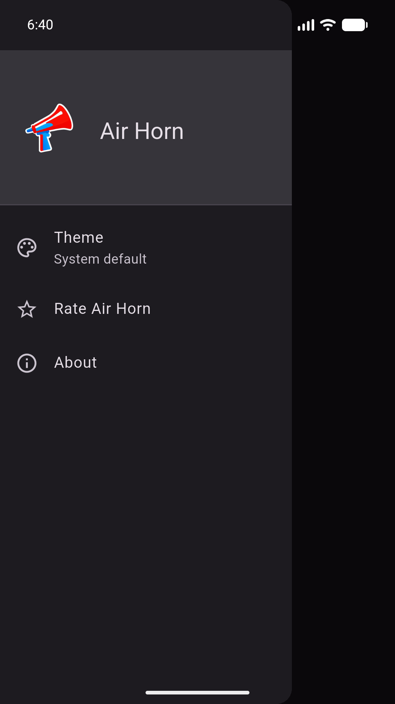
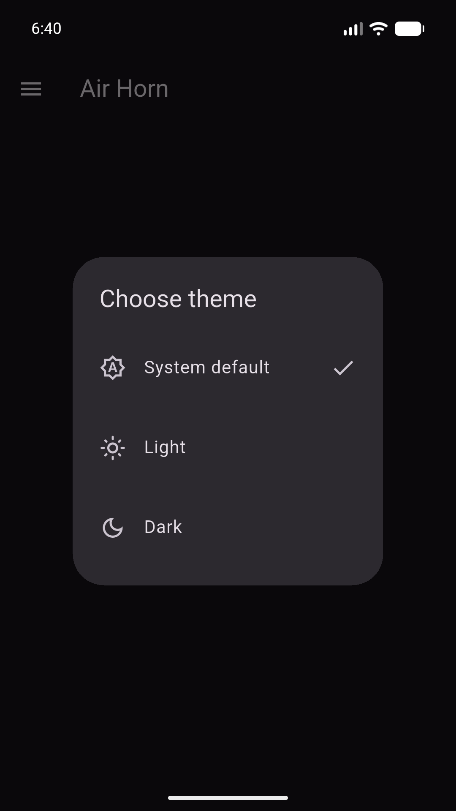

# Air Horn

A simple pocket air horn for Android. Press and hold the button for a continuous
horn, then release it to stop.

[](https://github.com/thecodepapaya/air_horn/actions/workflows/android-release.yml)
[](https://github.com/thecodepapaya/air_horn/releases/latest)

## Screenshots

<table>
  <tr>
    <td align="center">
      
    </td>
    <td align="center">
      
    </td>
    <td align="center">
      
    </td>
    <td align="center">
      
    </td>
  </tr>
  <tr>
    <td align="center"><strong>Light theme</strong></td>
    <td align="center"><strong>Dark theme</strong></td>
    <td align="center"><strong>Quick settings</strong></td>
    <td align="center"><strong>Theme picker</strong></td>
  </tr>
</table>

## Features

- Press and hold for continuous, low-latency horn playback.
- Haptic feedback and a helpful hint when the button is tapped too quickly.
- A volume reminder when media volume is muted.
- System, light, and dark themes with a saved preference.
- Quick access to theme settings, rating, and app information from the drawer.
- No accounts, ads, or tracking.

## Run locally

Air Horn is built with Flutter. Install a current stable Flutter SDK and an
Android development environment, then run:

```sh
flutter pub get
flutter run
```

To run the project checks:

```sh
flutter analyze
flutter test
```

## Releases

Pushing a version tag such as `v1.0.7` runs the GitHub Actions release workflow.
It analyzes and tests the app, builds a signed Android App Bundle, and attaches
the bundle to a GitHub Release.
